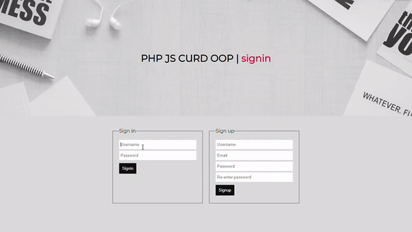

# Login-Registration-PHP-JavaScript
I have tried to implement a token authentication system for CURD operation in php.  
The idea is the same as Django-REST-framework. For updating, deleting, or reading the information, a certain token has to be provided.
# Preview:

